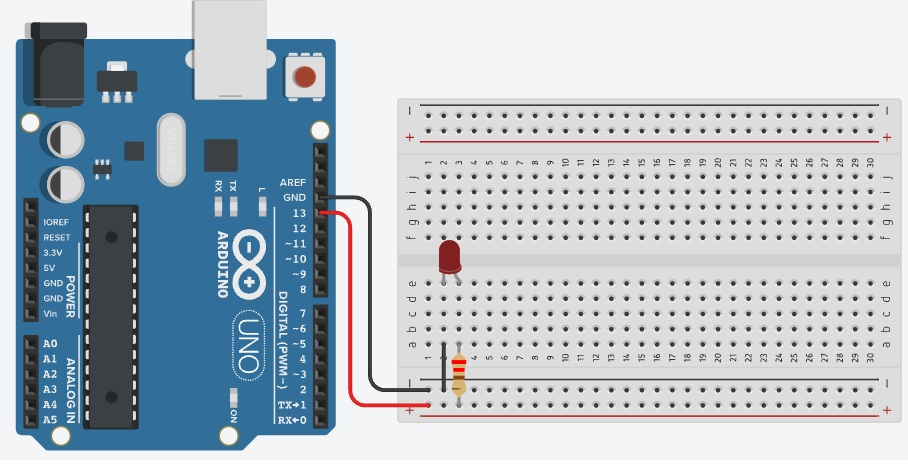

# Projeto Arduíno manipular um led.

## Contextualização

Neste experimento você irá fazer com que o LED incorporado e um LED pisque utilizando o pino digital 13 (pino digital incorporado LED_BUILTIN = 13). Neste experimento iremos utilizar outros componentes, como placa de prototipação, LED, jumper e resistor. 

## Esquema do projeto

## Projeto no Tinkercad

https://www.tinkercad.com/things/5scTOchu1G3